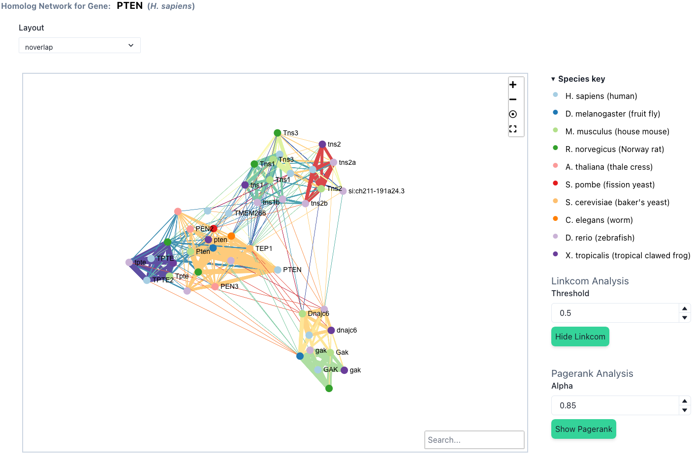
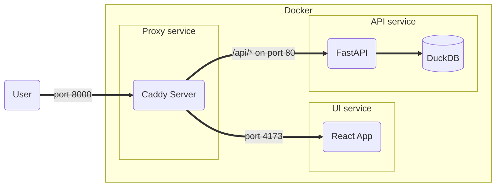

# homology-explorer

A tool for exploring orthology and paralogy relationships in model organism species.



[Demonstration Video](https://youtu.be/I-Q6B78EzIA)

## Requirements

**Software**

- node v18.16.0+ (https://nodejs.org)
- pnpm v8.3.1+ (https://pnpm.io/)
- python v3.10 (https://python.org)
- poetry v1.4.2+ (https://python-poetry.org/)

Note: This repository uses pnpm to manage javascript dependencies. Using npm or yarn may cause
issues due to the lock files not being used.

**Data**

The `homology-explorer` has only been tested to work with [DIOPT v8.5 TSV files](https://www.flyrnai.org/diopt).
The following files need to be obtained from DIOPT in order for the visualization to work.
Place these files (uncompressed) in the [data](./data) directory.

- Gene_Information.tsv
- Ortholog_Pair_Best.tsv

**Optional**

_Only required for Markdown to PDF conversion_

- pandoc
- tex

## Getting Started

The following commands clone the repo and install the javascript and python dependencies.

```shell
git clone git@github.com:jogoodma/homology-explorer.git
cd homology-explorer
pnpm install
poetry install
```

## Development

### Script commands

### Formatting

`black` is used for formatting python code. The configuration options for `black` are
controlled via the `[tool.black]` section of the [pyproject.toml](./pyproject.toml) file.

`prettier` is used for formatting JavaScript, Typescript, and Markdown files

### Setup

1. Follow the steps under [Getting Started](#Getting Started).
2. Install the `pre-commit` hooks.

```shell
poetry run pre-commit install
```

### PDF Generation

This package uses `pandoc`, `tex`, and `mermaid-filter` to generate PDF documentation from
markdown files. To generate a PDF first install `pandoc` and `tex` via your OS installer
of choice then do the following.

1. Clone the repo (if you have not already)
2. Change to repo directory
3. Install `mermaid-filter`
4. Run the command to generate a PDF

```shell
git clone git@github.com:jogoodma/homology-explorer.git
cd homology-explorer
pnpm install
pnpm run [DOCUMENT SCRIPT TARGET]
```

Replace `[DOCUMENT SCRIPT TARGET]` with one of the available commands listed under `scripts` in the
`package.json` file.

e.g.

```shell
pnpm run pandoc:proposal
```

### Docker

_Requirements_:

- Docker
- Docker compose
- DIOPT data files (in the `data` directory):
  - `Gene_Information.tsv`
  - `Ortholog_Pair_Best.tsv`
  - `Species.tsv`

To run a production build in Docker use the following commands.

```shell
docker volume create he_caddy_data
docker compose up -d --build
```

The volume command is only required one time.
This will build the database, the API server, the UI, and start a production server on port 8000.
To change the port set the `HOMOLOGY_EXPLORER_PORT` environment
variable.

e.g.

```shell
echo "HOMOLOGY_EXPLORER_PORT=8888" >> .env
```

#### Docker container overview


