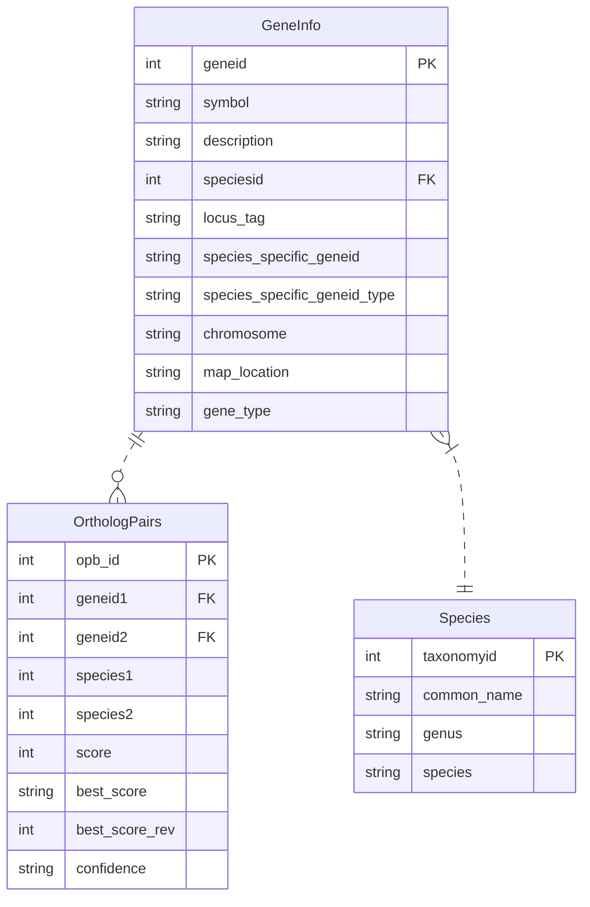

```mermaid
erDiagram

    OrthologPairs {
        int opb_id PK
        int geneid1 FK
        int geneid2 FK
        int species1      
        int species2      
        int score         
        string best_score
        int best_score_rev
        string confidence
    }

    GeneInfo {
        int geneid PK
        string symbol
        string description
        int speciesid FK
        string locus_tag
        string species_specific_geneid
        string species_specific_geneid_type
        string chromosome
        string map_location
        string gene_type
    }

    Species {
        int taxonomyid PK
        string common_name
        string genus
        string species
    }
    GeneInfo ||..o{ OrthologPairs: ""
    GeneInfo }|..|| Species : ""
```
