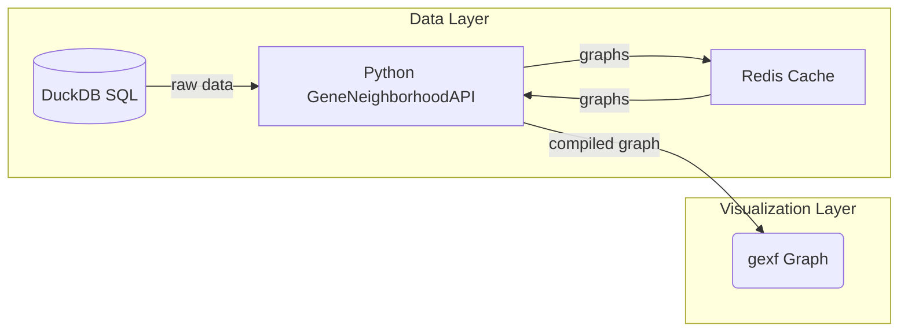

# Ideas for `GeneNeighborhoodAPI` Extensions

## `Redis` Caching

To store successive Graph data. Will help limit costly calls to SQL db.

```mermaid
flowchart LR

  subgraph Data Layer
    direction TB
    a[(DuckDB SQL)]--raw data-->b[Python GeneNeighborhoodAPI]
    b--graphs-->d[Redis Cache]--graphs-->b
  end

  subgraph Visualization Layer
    direction TB
    b--compiled graph-->c(gexf Graph);
  end
```
