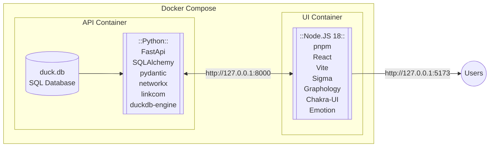

${toc}

# Abstract

# Introduction

Evolutionary genomics is an important field of study for biomedical researchers, especially with recent advances in treatments based in gene therapy^[https://www.nature.com/articles/s41467-020-19505-2].

EG mRNA techniques, etc.

Gene orthology allows researchers to compare genetic traits, both between and within species^[https://bio.libretexts.org/Bookshelves/Microbiology/Microbiology_(Boundless)/07%3A_Microbial_Genetics/7.13%3A_Bioinformatics/7.13C%3A_Homologs_Orthologs_and_Paralogs]. Although there are many methods for predicting homologous relationships between genes, recent related works^[DIOPT] have compiled a unified database cataloguing these relationships. While this is extremely useful for researchers, the tabular format of the database obscures the network embedding inherent in the data - whereby edges are predictions of relationships between genes, and the genes themselves are nodes.

This research aims to close the gap between biomedical researchers and the gene homology database by visualizing the gene homology network as an interactive, searchable web application capable of exploring orthologous relationships of individual genes, of lists multiple genes, and of their respective gene neighborhoods. To enhance the researchers understanding of these relationships, we also aim to provide network analysis tools via the UI to perform network operations of centrality measurement and link community detection.

# Methods

The schematic below outlines the web application design architecture. For portability, the application is packaged as a `docker-compose` image with two containers:

- The backend application programming interface (API) container runs the database and implements the `FastAPI` python framework to serialize, validate, and apply network and filtering analyses to the data.
- The frontend user interface (UI) container runs the visualization application by implementing the `Sigma.js` and `Graphology` network frameworks through a javascript `React` framework.



The code for this project is available on [Github](https://github.com/jogoodma/homology-explorer/tree/main). The tree structure below outlines the general directory structure of the app. Files and node modules not included, but will be revisited at various points throughout the report in more detail.

```
homology-explorer
├── apps
│   ├── docker-compose.yml
│   ├── api
│   │   ├── app
│   │   └── Dockerfile
│   └── ui
│       ├── node_modules
│       ├── public
│       ├── src
│       └── Dockerfile
├── data
└── docs
```

The sections below outline the methods used to develop the web application and implement the network analysis tools.

## Application Programming Interface

This section discusses the database warehousing of the gene homology network data, and the application programming interface (API) used to serve these data.

### Database

The original network data consist of three `.tsv` tables provided by DIOPT:

- `OrthologPairs.tsv`: this table contains the _edge_ data of predicted links between genes
- `GeneInfo.tsv`: this table contains the _node_ data of attributes associated with a given gene
- `Species.tsv`: this table relates the `species_id` field to a species' common and scientific/latin names.

To construct the database, these tables are first extracted from the `tar.gz` file and the `duckdb` package is leveraged by the `dbBuilder.py` file to create the `duck.db`.

```
data
├── GeneInfo.tsv
├── OrthologPairs.tsv
├── Species.tsv
├── dbBuilder.py
└── duck.db
```

Each `.tsv` file is loaded into the database as a table. However, the tables are not called by the API. Instead, a variety of views are used to query data from the tables into formats expected by the various `FastAPI` models. In general, SQL is leveraged in the pre-processing stage to address computationally intensive tasks such as join operations.

An explanation of the tables and views are below:

**_Tables_**

- **tblSpecies**
  - Original table relating `species_id` to common and scientific names.
- **tblGeneInfo**
  - Original table of attributes for each `geneid` (node).
- **tblOrthologPairs**
  - Original table of attributes for each `opb_id` (edge).
  - Also identifies `geneid1` and `geneid` genes as the source and target nodes of the edge.

**_Views_**

- **evwGeneFrequency**
  - View aggregates `tblOrthologPairs` to count the frequency of each `geneid`.
- **evwSymbolSearch**
  - View joins to `tblGeneInfo` the `tblSpecies.common_name` and `evwGeneFrequency.frequency` to engineer additional features.
  - This table is used for queries related to UI dynamic search results.
- **evwGeneInfo**
  - View joins to `tblGeneInfo` the `tblSpecies` attributes to provide a richer result for queries accessing node information.
- **evwOrthologPairs**
  - View adds attribute `homolog_type` as binary classification of a given homolog as a ortholog or a paralog.
- **evwGeneNeighborEdges** & **evwGeneNeighborEdgesAttr**
  - Views are called together to serialize the edge attributes from `tblOrthologPairs` as a nested dictionary below the `key`, `source`, and `target`.
  - These views also only select edges which are the `best_score`.
- **evwGeneNeighborEdgelist**
  - View called to serialize the edge information from `tblOrthologPairs` into an edgelist format readable by `networkx`.
- **evwGeneNeighborNodes** & **evwGeneNeighborNodesAttr**
  - Views are called together to serialize the node attributes from `tblGeneInfo` as a nested dictionary below the `key`.
  - The `evwGeneNeighborNodesAttr` view also joins the `tblSpecies` attribtues to `tblGeneInfo` to enrich the attribute output.

The `dbBuilder.py` script constructs this `duck.db` database using the DuckDB python API. Once constructed, it is then embedded the API application at `apps/api/app/duck.db` where it is accessed by `FastAPI` as needed.

### `FastAPI`

In order for web application users to efficiently access the newly created orthology database, an API can be used to broker, transform, and validate data between the database and the UI. Python is the preferred language for this API because it allows us to easily use the `networkx` library to analyze network data in real-time.

`FastAPI` is a popular python web framework focused on high performance and easy development, and was selected as the framework for our web application backend. It was selected over more popular frameworks Django and Flask due to its comparative performance advantage^[https://www.techempower.com/benchmarks/#section=data-r21&hw=ph&test=query&l=zijzen-35r&d=b&f=0-0-6bk-0-0-0-b8jk-0-1ekg-4fti4g-0-0-0-0&c=d] and ease of implementation. The framework as applied here is largely based off this official tutorial^[https://fastapi.tiangolo.com/tutorial/sql-databases/] from the `FastAPI` documentation.

Below is an example directory tree of the `FastAPI` service embedded with the `duck.db`.

```
apps/api
├── app
│   ├── __init__.py
│   ├── crud.py
│   ├── database.py
│   ├── duck.db
│   ├── main.py
│   ├── models.py
│   └── schemas.py
├── Dockerfile
└── requirements.txt
```

- **database.py**
   - This file handles session connections to the database
- **models.py**
   - This file structures the SQL tables into an object relational model (ORM)
   - Once instantiated as an ORM object, the tables are easy to manipulate using other python libraries. 
- **schemas.py**
   - This file enforces data types and structural representations of ORM objects
   - Both objects used for posts and responses can be validated according to these schema
- **crud.py**
   - This file contains functions for parsing, analyzing, and transforming ORM objects
   - Also contains capability for interacting with the database via the API using CRUD operations 
- **main.py**
   - This file packages the functions and CRUD operations with the ORM models and serves the requests through HTTP API calls. 
   - It also validates POST and GET operations and constrains inputs/outputs according to design specifications, and assigns query and path parameters to HTTP routes. 

The interface works more or less as follows for each of the API endpoints:

- The API is turned on via `uvicorn` ASGI^[https://asgi.readthedocs.io/en/latest/] (Asynchronous Server Gateway Interface) 
- Database connection is made when a user makes a request
- A user sends an HTTP request to the open port to match the query and path parameters specified by the available API endpoints in `main.py`. 
- If a valid endpoint is called, then the endpoint 
   - validates the query/path parameters by type for GET calls and by schema for POST calls
   - executes it's selection of CRUD operations by calling on the ORM models connected to the database
   - serializes an output or returns error code
   - validates the output of the CRUD operations by schema
   - returns HTTP response body

And that's it! The API endpoints all vary somewhat depending on their intended purpose, but follow this general pattern of operations. Some API calls only involve one database CRUD call, while some are composed of three or four. 

### API Endpoints

In the case of this API, all of the endpoints are designed to help a user explore the network of genes as defined by the DIOPT database. These endpoints are discussed individually at length below.

#### General Information

GET Calls:
- `/search/gene/symbol/{symbol}/`
- `/geneinfo/gene/{gene_id}/`
- `/orthologpairs/gene/{gene_id}/`

These endpoints query basic information from the database tables. The symbol search is used to populate search results for the dynamic gene search option at the beginning of the UI. The other two endpoints return node or edge data for a single requests gene. The edge data returns a list of all edges attached to the requested node (gene).

#### Multigene Requests

POST Calls:
- `/geneinfo/multigene/`
- `/orthologpairs/multigene/`

These endpoints require the user to post a list of `geneid`s which are then parsed using and `in` SQL comparative instead of an `=` as used in the case of the single `geneid` calls in the general information endpoints. In this way, the multigene endpoints is able to provide node and edge info as above but instead for a list of genes. 

#### The Gene Neighborhood

GET Calls:
- `/geneneighboredges/gene/{gene_id}/`
- `/geneneighbornodes/gene/{gene_id}/`

POST Calls:
- `/geneneighboredges/multigene/`
- `/geneneighbornodes/multigene/`

These `geneneighbor*` endpoints are composed of two CRUD operations. The first CRUD operation for each endpoint computes the *gene neighborhood* to build a list of all the distinct first degree neighbors of the requested gene or genes. This operation can be parameterized by an upper pr lower bound to constrain the neighbors to be only those first degree neighbors with weights constrained by the bounds - this acts as a way to filter a neighborhood's edges by weight. 

By calling a commonly parameterized initialization function, the gene neighborhood allows easily for multiple different API calls to reference the same list of edges. This both makes the syntax easily accessible to users and allows for the same subgraph to be easily requeried for a variety of different information. 

The second CRUD operation then fetches either:
1. Nodes, and the gene information is returned for each node in the first degree neighborhood of the gene or genes. Or,
2. Edges, and a list of homolog edges are returned for each edge between each node pair in the 1st degree neighborhood of the requested gene or genes' neighborhood. 

TODO: Update `crud.get_GeneNeighborEdgelist` to take as arguments the weight_lb and weight_ub

The gene neighborhood represents the closest related genes to those queried as defined by various homology prediction algorithms.

#### Network Analysis

POST Calls:
- `/geneneighboredges/multigene/{analysis}`
- `/geneneighbornodes/multigene/{analysis}`


## User Interface

### Dynamic Search

### Visualization

# Results

## Example 1

## Example 2

## Example 3

# Discussion

## Next Steps

# References
