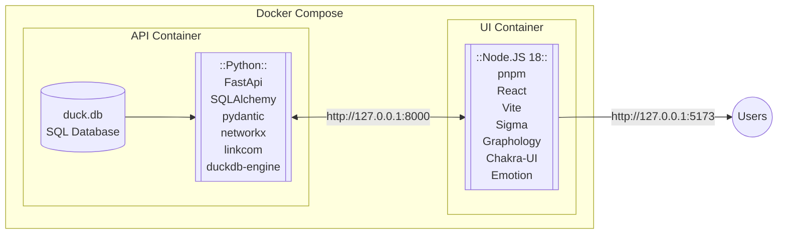

${toc}

# Abstract

# Introduction

Evolutionary genomics is an important field of study for biomedical researchers, especially with recent advances in treatments based in gene therapy^[https://www.nature.com/articles/s41467-020-19505-2]. 

EG mRNA techniques, etc.

Gene homology allows researchers to compare genetic traits, both between and within species^[https://bio.libretexts.org/Bookshelves/Microbiology/Microbiology_(Boundless)/07%3A_Microbial_Genetics/7.13%3A_Bioinformatics/7.13C%3A_Homologs_Orthologs_and_Paralogs]. Although there are many methods for predicting homologous relationships between genes, recent related works^[DIOPT] have compiled a unified database cataloguing these relationships. While this is extremely useful for researchers, the tabular format of the database obscures the network embedding inherent in the data - whereby edges are predictions of relationships between genes, and the genes themselves are nodes. 

This research aims to close the gap between biomedical researchers and the gene homology database by visualizing the gene homology network as an interactive, searchable web application capable of exploring homologous relationships of individual genes, of lists multiple genes, and of their respective gene neighborhoods. To enhance the researchers understanding of these relationships, we also aim to provide network analysis tools via the UI to perform network operations of centrality measurement and link community detection. 

# Methods

The schematic below outlines the web application design architecture. For portability, the application is packaged as a `docker-compose` image with two containers:

- The backend application programming interface (API) container runs the database and implements the `FastAPI` python framework to serialize, validate, and apply network and filtering analyses to the data. 
- The frontend user interface (UI) container runs the visualization application by implementing the `Sigma.js` and `Graphology` network frameworks through a javascript `React` framework. 

The code for this project is available on [Github](https://github.com/jogoodma/homology-explorer/tree/main). The sections below outline the methods used to develop the web application and implement the network analysis tools. 

## Application Programming Interface

This section discusses the creation of the database warehousing the gene omology network data, and the application interface used to serve these data. 

### Data Accessibility

The original network data consist of three `.tsv` tables provided by DIOPT:

- OrthologPairs.tsv: this table contains the *edge* data of predicted links between genes
- GeneInfo.tsv: this table contains the *node* data of attributes associated with a given gene
- Species.tsv: this table relates the `species_id` field to a species' common and scientific/latin names.

To construct the database, these tables are first extracted from the `tar.gz` file and the `duckdb` package is leveraged by the `dbBuilder.py` file to create the `duck.db`. The tables of the 

### Network Analysis

## User Interface

# Results

# Discussion

# References

