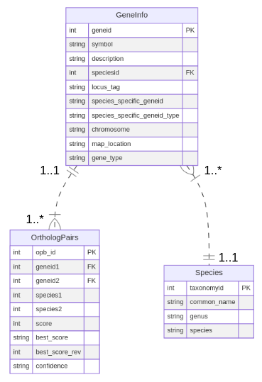
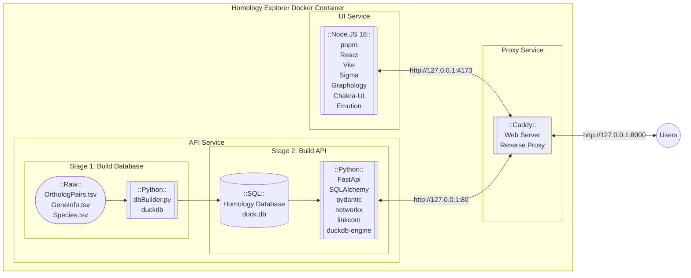
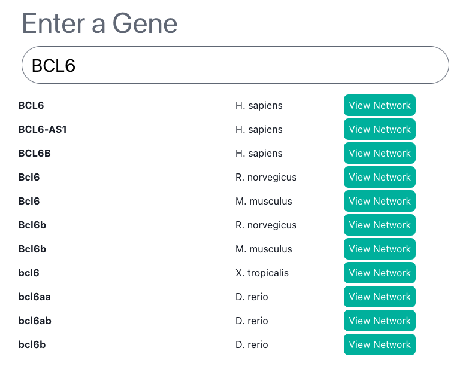

${toc}

# Abstract

# Introduction

Evolutionary genomics is an important field of study for biomedical researchers, especially with recent advances in treatments based in gene therapy^[https://www.nature.com/articles/s41467-020-19505-2].

EG mRNA techniques, etc.

Gene homology allows researchers to compare genetic traits, both between and within species^[https://bio.libretexts.org/Bookshelves/Microbiology/Microbiology_(Boundless)/07%3A_Microbial_Genetics/7.13%3A_Bioinformatics/7.13C%3A_Homologs_Orthologs_and_Paralogs]. Although there are many methods for predicting homologous relationships between genes, recent related works^[DIOPT] have compiled a unified database cataloguing these relationships. While this is extremely useful for researchers, the tabular format of the database obscures the network structure inherent in the data - whereby edges are predictions of relationships between genes, and the genes themselves are nodes.

This research aims to close the gap between biomedical researchers and the gene homology database by visualizing the gene homology network as an interactive, searchable web application capable of exploring orthologous and paralogous relationships of individual genes, of lists multiple genes, and of their respective gene neighborhoods. To enhance the researchers understanding of these relationships, we also aim to provide network analysis tools via the UI to perform network operations of centrality measurement and link community detection.

## Problem Statement

Although data have been compiled to catalogue and rank relationships between genes predicted by a variety of different models, there is not an easily accessible way for researchers to access this data. This leads us to the first and main problem: 

> Provide an easily accessible visual interface allowing genetic researchers to intuitively explore the gene homology network. 

To solve this problem, the team has decided to design a web application to serve network visualization and analysis of the network data in a way that allows users to explore the gene homology network with focus and ease. 

Some additional problem constraints were as follows:

- The application should be easily hostable so that it can be run easily and independently by researchers or hosted on the web.
- The application should to be designed to a production-grade standard such that the application could support a moderate amount of concurrent users. 
- The application should provide an interactive and reactive user interface and allow for users to both search for and drill into various different genes, as well as tailor their results based on parameterizations of the various network operations.

## Project Execution Roadmap

# Methods

The `Homology Explorer` application is an answer to the problem statement above. The sections below outline the technical methodology applied to design and build a prototype of this application. 

## Homology Data

The source of the homology network data consist of three static `.tsv` tables. The table below outlines the attributes for each table listing the datatype to the left of the attribute name and either `pk` or `fk` to designate fields that are primary keys (to uniquely identify records) and foreign keys (to relate attributes across the tables).



**Figure XX** - Entity Relationship Diagram of the source data tables.

Some notes on each table and its attributes:

- `OrthologPairs.tsv` :: 11,099,012 records
   - This table contains the _edge_ data for the network.
   - For a given directed edge uniquely identified by `opb_id`, `geneid1` and `geneid2` correspond to the source and target nodes and the `score` corresponds to the edge weight. 
   - The `score` attribute denotes the number of prediction algorithms that predict an homologous relationship from a source gene to a target gene. `best_score` indicates whether a given directed edge has superior weight compared to its inverse edge (directed instead from the _target_ to the _source_). `confidence` is a category derived from `score`.
- `GeneInfo.tsv` :: 371,760 records
   - This table contains the _node_ data of attributes associated with a given gene.
   - The `GeneInfo.geneid` field relates to the `OrthologPairs.geneid*` while the `symbol` and `description` help to colloquially identify a given gene.
   - `chromosome` and `gene_type` are additional descriptive attributes for the gene, while the `map_location` is a legacy methodology for identifying different genes. 
- `Species.tsv` :: 10 records
   - This table contains taxonomy information for the species to which the genes in our database belong. 
   - The `Species.taxonomyid` field relates to the `GeneInfo.speciesid` field to provide a given species' common and scientific/latin names.

## Web Application Design

At its core, the `Homology Explorer` application aims to serve network data visualizations to users. An application is designed consisting of four key components to accomplish this task, as overviewed below:

- **Pre-processing the source data** converts the static `.tsv` files into a Duck database `.db` format. This stage joins and permutes the data to a new static form that will be easily accessible by the web application. 
- A `Caddy` **Web Server** manages SSL encryption and routes HTTP traffic between the API and UI services, and the users.
- The backend **Application Programming Interface** (API) service runs the database and implements the python `FastAPI` object relational model (ORM) framework to aynchronously manage database access, serialize, validate, and apply network and filtering analyses to the data.
- The frontend **User Interface** (UI) service runs the visualization application by implementing the `Sigma.js` and `Graphology` network libraries through a javascript `React` framework.

The schematic below outlines the described web application architecture.



```
homology-explorer
├── apps
│   ├── api
│   │   ├── app
│   │   └── Dockerfile
│   └── ui
│       ├── node_modules
│       ├── public
│       ├── src
│       └── Dockerfile
├── data
├── docs
├── Caddyfile
├── docker-compose.yml
├── pnpm-lock.yaml
├── poetry.lock
└── pyproject.toml

```

The tree above outlines the general directory structure of the app and will be revisited at various points throughout the report in more detail. The code for this project is available on [Github](https://github.com/jogoodma/homology-explorer/tree/main). The subsequent sections outline the technical implementation of the above described web application design in such a way as to satisfy the constraints set out by the problem statement.

## Database Construction

The source data have a fixed schema and are relational so managing them through a SQL database is a natural design choice^[cite some stuff from database class]. Of the myriad flavors of SQL to choose from, the `Homology Explorer` uses Duck Database^[https://duckdb.org/]. Duck database is a lightweight SQL database similar to SQLite. Because the dataset  however, it is more performant and provides many more features than SQLite. It also has good documentation and a rich python API. To construct the database, these tables are first extracted from the `tar.gz` file. Next the `duckdb` python library is used by `dbBuilder.py` file to create the application database: `duck.db`.

```
data
├── GeneInfo.tsv
├── OrthologPairs.tsv
├── Species.tsv
├── dbBuilder.py
└── duck.db
```

Each `.tsv` file is loaded to the database as a table. However, the tables themselves are not exposed to the web application. Instead, a variety of views query data from the tables into formats expected by the API object relational models. This is advantageous from an application performance standpoint since initializing the data into the ORM formats sometimes requires computationally intensive `JOIN` operations for which SQL is optimized.

Below are described the various tables and views created by the `dbBuilder.py`:

**_Tables_**

- **tblOrthologPairs**
  - Original table of attributes for each `opb_id` (edge).
- **tblGeneInfo**
  - Original table of attributes for each `geneid` (node).
- **tblSpecies**
  - Original table relating `species_id` to common and scientific names.

**_Views_**

- **evwGeneFrequency**
  - View aggregates `tblOrthologPairs` to count the frequency of each `geneid`.
- **evwSymbolSearch**
  - View joins to `tblGeneInfo` the `tblSpecies.common_name` and `evwGeneFrequency.frequency` for queries related to UI dynamic search results.
- **evwGeneInfo**
  - View joins to `tblGeneInfo` the `tblSpecies` attributes to provide a enrich queries accessing node attributes.
- **evwOrthologPairs**
  - View adds edge attribute `homolog_type` as binary classification of a given homolog as either an _ortholog_ (inter-species) or a _paralog_ (intra-species).
- **evwGeneNeighborEdges** & **evwGeneNeighborEdgesAttr**
  - Views are called together to serialize the edge attributes from `tblOrthologPairs` as a nested dictionary below the `key`, `source`, and `target`.
  - These views _only_ select edges which are the `best_score`.
- **evwGeneNeighborEdgelist**
  - View called to serialize the edge attributes from `tblOrthologPairs` into an edgelist format readable by `networkx`.
- **evwGeneNeighborNodes** & **evwGeneNeighborNodesAttr**
  - Views are called together to serialize the node attributes from `tblGeneInfo` as a nested dictionary below the `key`.
  - The `evwGeneNeighborNodesAttr` view also joins the `tblSpecies` attributes to `tblGeneInfo` to enrich the attribute output.

The `dbBuilder.py` script constructs this `duck.db` database using the DuckDB python API. Once constructed, it is then embedded the API service at `apps/api/app/duck.db` where it is accessed by the web application as needed.

## Application Programming Interface

An application programming interface (API) can be used to efficiently broker, transform, and validate data between the database and the UI by managing the database requests made by the UI as the user interacts with the application. Python is the preferred language for this API because the application relies on the extensive `networkx` python library to compute network analyses. Keeping the API semantics within the same language as the main computational library maintains a level of desirable level of simplicity. 

`FastAPI` is a popular python RESTful API web framework focused on high performance and easy development^[https://fastapi.tiangolo.com/]. We selected the framework for our web application backend because:
- `FastAPI` can run asynchronously through an ASGI^[https://asgi.readthedocs.io/en/latest/] (Asynchronous Server Gateway Interface) which allows it to efficiently enqueue, await, and handle API calls from multiple concurrent users. It also boosts performance for API calls requiring multiple SQL queries to construct the response body. 
- `FastAPI` supports object relational modelling through the `SQLAlchemy` library to mix the database queries seamlessly with the `networkx` python library. 
- `FastAPI` supports datatype validation through the `types` and `pydantic` libraries. This ensures the API is sending an appropriate valid response to a requester, and helps determine if the request is even valid in the first place. 
- `FastAPI` also supports several methods for implementing a cache-aside framework which can help increase performance for APIs with high throughput. Since that is an expected use-case scenario for this application, this version has *not* been developed with cacheing. This may be an advantageous feature one day in the future if the application use-case ever expands. 
- `FastAPI` has the Swagger Docs interface tool enabled by default which makes developing the API much easier by providing an easy way to test different API requests, responses, and ORM schemas.
- There is good documentation and it is a relatively easy framework to learn and implement. For example, this API application is largely inspired by this official tutorial^[https://fastapi.tiangolo.com/tutorial/sql-databases/] from the `FastAPI` documentation.

Below is an example directory structure of the `FastAPI` API service embedded with the `duck.db` database.

```
apps/api
├── app
│   ├── __init__.py
│   ├── crud.py
│   ├── database.py
│   ├── duck.db
│   ├── main.py
│   ├── models.py
│   └── schemas.py
├── Dockerfile
└── requirements.txt
```

- **database.py**
   - This file handles ORM session connections to the database with `SQLAlchemy`.
- **models.py**
   - This file structures the SQL tables into an object relational model (ORM) with `SQLAlchemy`.
   - Once instantiated as an ORM object, the tables are easy to manipulate using other python libraries. 
- **schemas.py**
   - This file enforces data types and structural representations of ORM objects with `pydantic`.
   - Both objects used for posts and responses are validated according to these schema.
- **crud.py**
   - This file parses, analyzes, and transforms ORM objects with `SQLAlchemy` and `networkx`.
- **main.py**
   - This file functionalizes the `crud.py` operations and serves the requests through HTTP API calls with `FastAPI`
   - It also validates POST and GET operations and constrains inputs/outputs according to design specifications, and assigns query and path parameters to HTTP routes. 

This API is run through the `uvicorn`^[cite Uvicorn] ASGI as recommended by the `FastAPI` documentation^[cite]and works, more or less, as follows for each of the API endpoints:

- The UI sends an HTTP request with the query and path parameters specified by one of the available API endpoints in `main.py`. 
- If a valid endpoint is called, the endpoint then:
   - _validates the request_ body schema and the query and path parameter datatypes.
   - _executes_ CRUD operations by transforming the ORM models connected to the database.
   - _serializes_ a response to a particular output format.
   - _validates the response_ datatypes according to a given output schema.
   - _returns_ the HTTP response body to the requester.

And that's it! The API endpoints all vary somewhat depending on their intended purpose, but follow this generalized order of operations. Some API endpoints only involve one database query while others are composed of several database queries. In the case of this API, all of the endpoints are designed to help a user explore the network of genes stored by the gene homology database. These endpoints are discussed individually at length in the sections below.

### Information and Search

GET Calls:
- `/search/gene/symbol/{symbol}/`
- `/geneinfo/gene/{gene_id}/`
- `/orthologpairs/gene/{gene_id}/`

These endpoints query basic information from views of the database tables. The `/search/gene/symbol/` endpoint is used to populate search results for the dynamic search option at the beginning of the UI. The other two endpoints return either the node attributes or a list of edges attached to the single requested gene.

### Multigene Requests

POST Calls:
- `/geneinfo/multigene/`
- `/orthologpairs/multigene/`

These endpoints require the user to post the request body as a list of `geneid`s. The endpoint parses the list by changing the comparative of the SQL `WHERE` clause from `=` (as used in the `/.../gene/` GET endpoints) to `IN`. In this way, the multigene endpoints are able to provide node and edge info in a similar manner to the single gene endpoints, but for a list of genes instead. 

### The Gene Neighborhood

GET Calls:
- `/geneneighboredges/gene/{gene_id}/`
- `/geneneighbornodes/gene/{gene_id}/`

POST Calls:
- `/geneneighboredges/multigene/`
- `/geneneighbornodes/multigene/`

These `geneneighbor*` endpoints are composed of two CRUD operations. The first CRUD operation for each endpoint computes the *gene neighborhood*, a list of all the distinct first degree neighbors of the requested gene or genes. This operation can be parameterized by an upper or lower bound to constrain the neighbors to only those first degree neighbors whose weights are constrained by the bounded interval. This provides a way to filter a neighborhood's edges by weight. 

By calling a commonly parameterized initialization function the gene neighborhood allows for multiple different API calls to reference the same subgraph of nodes. This makes these kinds of calls easier for developers to implement by allowing the same subgraph to be easily re-queried for a variety of different information. 

The second CRUD operation then fetches either:
1. Nodes - and then returns gene information for each node in the gene neighborhood of the requested gene or genes; or,
2. Edges - and then returns a list of homolog edges for each edge between each node pair within the gene neighborhood of the requested gene or genes. 

TODO: Update `crud.get_GeneNeighborEdgelist` to take as arguments the weight_lb and weight_ub

The gene neighborhood represents the closest related genes to those queried as defined by various homology prediction algorithms. 

### Network Analysis

POST Calls:
- `/geneneighboredges/multigene/{analysis}`
- `/geneneighbornodes/multigene/{analysis}`

A network analysis endpoint is available for computing network attributes on either nodes or edges while the requested network analysis is passed to the endpoint as a path parameter string. Additional query parameters can also be used to toggle the output of the analysis by tuning various hyperparameters. Network analysis endpoints are constructed in a manner similar to the multigene gene neighborhood endpoints and operate as follows:

1. The MultiGene Neighborhood query is called and the resultant edge information are serialized to an edgelist format - a list of 3-dimensional tuples composed of the source and target genes and weight for a given edge.
2. The edgelist is converted to an `nx.Graph()` object upon which is run a `networkx` function of some kind. This returns an edgelist or nodelist with the newly calculated network analysis attribute.
3. The newly calculated attribute from step 2 is appended to the node or edge attributes for the gene neighborhood determined in step 1. This returns a new list of edges or nodes along with all the attributes (original and calculated) for each object of the list. 

This framework is advantageous since the only difference between each network analysis is the CRUD operation performing the `networkx` function called in step 2. These CRUD operations are quite simple to construct, and then it is just a matter of making the path parameter available as a request to the network analysis endpoint. 

For example, the network CRUD operation for the `geneneighbornodes/multigene/PageRank/` call only consists of 8 lines:

```python
def get_Pagerank(db: Session, edgelist: list, alpha: float):
     
    g = nx.DiGraph()
    g.add_edges_from(edgelist)
    
    pagerank = nx.pagerank(g, alpha=alpha, weight='weight')
    
    newnodeattr = [
        { 'key': key, 'attributes': { 'pagerank': value } }
        for key, value in pagerank.items()
    ]
    
    return newnodeattr
```

... and the network CRUD operation for the `geneneighboredges/multigene/Linkcom/` call consists of scant more:

```python
def get_Linkcom(db: Session, edgelist: list, threshold: float):
    
    g = nx.Graph()
    g.add_edges_from(edgelist)
    
    e2c,_ = linkcom.cluster(
        g, threshold=threshold, 
        is_weighted=True, weight_key='weight',
        to_file=False
    )
    
    newedgeattr = [ 
        { 
          'source': key[0], 
          'target': key[1],
          'attributes': {
            'linkcom': value
          }
        } for key, value in e2c.items()
    ]
    
    return newedgeattr
```


## User Interface

### Core Dependencies

The user interface for the Homology Explorer is primarily written in Typescript with the following libraries providing
the core functionality:

* React - View layer responsible for controlling the overall layout, the graph components, user interactivity, and managing application state
* react-sigma - Utility library for bridging functionality between React and Sigma.js
* Sigma.js - Graph visualization library
* Graphology - Graph library for representing and working with graph data structures.
 
A list of all dependencies can be found in the [UI package.json file](https://github.com/jogoodma/homology-explorer/blob/docker/apps/ui/package.json).

### Sigma.js

Sigma.js was chosen over other web visualization libraries (e.g. CytoscapeJS and Vega) for its use of
Canvas vs SVG and its tight integration with Graphology. Canvas provides better performance over SVG when the number
of objects displayed / manipulated is large. 

### Dynamic Search

The landing page of the Homology Explorer is our simple dynamic search page. This page has a simplistic single
input field that allows a user to enter a gene symbol. As the user types, an autocomplete box appears, showing them
the available genes that match their query (Figure XX). Clicking the "View Network" box then takes the user to the primary
network visualization.



**Figure XX** - Example of a dynamic search for BCL6.

### Visualization

# Results

## Example 1

PTEN

## Example 2

BCL6

## Example 3

18w

# Discussion

## Next Steps

# References

1. React, https://react.dev/
2. Typescript, https://www.typescriptlang.org/
3. react-sigma, https://sim51.github.io/react-sigma/
4. sigma.js, https://www.sigmajs.org/
5. Graphology, https://graphology.github.io/
