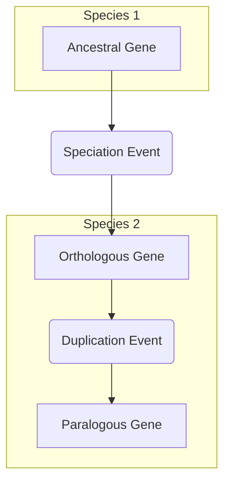

# Homology Explorer Proposal

## TODO - REMOVE WHEN COMPLETED

 - [ ] Abstract
 - [X] Introduction (draft)
 - [ ] Approach and Plan (draft)
 - [ ] Related work (draft)
 - [ ] Candidate methods (draft)
 - [ ] Final draft

## Team members

* Josh Goodman
* Mark Green

## Abstract

## Introduction

In the field of human genetic research, model organisms play a crucial role in helping to decipher functional mechanisms,
disease mechanisms, variant impact, and many other aspects of genes (citation). Researchers in this field of study
rely on previously published data in their organism of interest and also related organisms
to discover as much information as possible. A geneticist studying the *KRAS* gene in humans might look for
studies on related genes in mice or rats before designing experiments or looking for drug targets.
These related genes are called orthologs. Orthologs are homologous genes that are the result of a speciation event
[[4]](#homologs).  In other words, a gene in one species that is directly, but possibly distantly, related to a gene
in another species over an evolutionary time period. Relatedly, paralogs, genes that are the result of a 
duplication event withiin a species, can also be used for this same purpose (figure 1).

**Figure 1:** Origin of orthologous and paralogous genes.

The exact definition of what constitutes an ortholgous or paralogous pair of genes has been an active area of study for decades (citation).
Over this time, many orthology prediction algorithms have been developed, making it difficult for reseachers to select one over
the other. To address this issue a meta-orthology tool called DIOPT [[1]](#diopt) was developed by the Perrimon lab at 
Harvard Medical School. DIOPT takes the approach of aggregating as many orthology and paralogy algorithm prediction results as
possible and presenting all to the end user when a search for one or more genes is conducted. Each homologous pair of genes is scored
according to the number of algorithms that have predicted their evolutionary relationship. The tool allows users to enter one or more
genes and view results in a tabular format.

This functionality, while useful, fails to convey the relationships between the genes being queried, relationships to orthologous genes
in other species, and paralogous genes in a visual manner. Herein, we propose the development of a network visualization tool that will
allow researchers to explore these relationships, filter based on species, algorithm scores, or other attributes, and easily link out to
primary source databases for additional information.

## Related work

To date, the presentation of results from DIOPT have been limited to tabular HTML results or downloadable tab separated files
([3](#alliance), [5](#flybase)).

## Approach and Plan

### Overview

### Acquisition

Briefly discuss how we plan to acquire the data, from what sources, and what (if any) processing might be required.

### Data warehouse

No need for a lot of detail here, but I think we should give a high level overview of building a data warehouse. 
The whys and possible hows.

### Processing and Analysis

Any processing and data analysis that we think we might want to do.

### Visualization

Talk a little bit about our visualization options. Maybe mention the limitations of each
in terms of the network size that they support.

**TODO: Temporary notes on ideas for this section**

- Data acquisition, processing, and analysis
  - Python 
- Creation of a data warehouse for storing graph information
  - NoSQL: DuckDB, SQLite, MongoDB, JSON 
  - SQL: PostgreSQL 
  - GraphDB: Dgraph, JanusGraph, or Neo4J
- Possible network analysis to add value to homology data
- Web application that is either pregenerated or fetches data from a "live" API to provide data
  exploration, filtering, and basic analysis
  - Web frameworks
    - [Astro](https://astro.build)
    - [Remix](https://remix.run)
  - Network visualization
    - [Cytoscape.js](https://js.cytoscape.org/)
    - [Sigma](https://sigmajs.org)
    - [Vega](https://vega.github.io/vega/)

### Potential data sources

- [DIOPT](https://www.flyrnai.org/diopt) - Meta orthologs and paralogs [[1]](#diopt)
- [Alliance of Genome Resources](https://www.alliancegenome.org/) - Various model organism data (functional, disease associations, etc.) [[3]](#alliance).

### Candidate methods to develop or apply

## References
<a name="diopt">[1]</a>
  Hu Y, Flockhart I, Vinayagam A, Bergwitz C, Berger B, Perrimon N, Mohr SE.
  An integrative approach to ortholog prediction for disease-focused and other functional studies.
  BMC Bioinformatics. 2011 Aug 31;12:357. doi: 10.1186/1471-2105-12-357. PMID: 21880147; PMCID: PMC3179972.

<a name="marrvel">[2]</a>
  Wang J, Al-Ouran R, Hu Y, Kim SY, Wan YW, Wangler MF, Yamamoto S, Chao HT, Comjean A, Mohr SE; UDN; Perrimon N, Liu Z, Bellen HJ.
  MARRVEL: Integration of Human and Model Organism Genetic Resources to Facilitate Functional Annotation of the Human Genome.
  Am J Hum Genet. 2017 Jun 1;100(6):843-853. doi: 10.1016/j.ajhg.2017.04.010. Epub 2017 May 11. PMID: 28502612; PMCID: PMC5670038.

<a name="alliance">[3]</a>
  Alliance of Genome Resources Consortium. Harmonizing model organism data in the Alliance of Genome Resources.
  Genetics. 2022 Apr 4;220(4):iyac022. doi: 10.1093/genetics/iyac022. PMID: 35380658; PMCID: PMC8982023.

<a name="homologs">[4]</a>
  Koonin EV.
  Orthologs, paralogs, and evolutionary genomics.
  Annu Rev Genet. 2005;39:309-38. doi: 10.1146/annurev.genet.39.073003.114725. PMID: 16285863.

<a name="flybase">[5]</a>
  Gramates LS, Agapite J, Attrill H, Calvi BR, Crosby MA, Dos Santos G, Goodman JL, Goutte-Gattat D, Jenkins VK, Kaufman T, Larkin A, Matthews BB, Millburn G, Strelets VB; the FlyBase Consortium.
  FlyBase: a guided tour of highlighted features.
  Genetics. 2022 Apr 4;220(4):iyac035. doi: 10.1093/genetics/iyac035. PMID: 35266522; PMCID: PMC8982030.

## Acknowledgments
