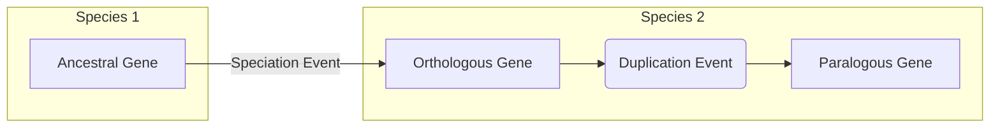
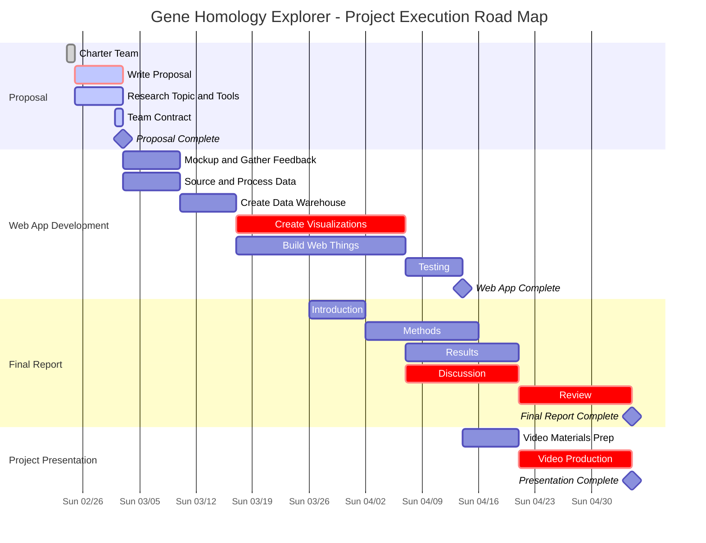

# Abstract

Genetic homology between species can allow researchers to better understand the relationships of cross-special diseases, functional groups, and gene ontology. Existing tools to predict and model these relationships do not provide researchers a wholistic view of genetic ontology. The Gene Homology Explorer project aims to remedy this by creating, visualizing, and analyzing the network of homological gene relationships between species with a web application. Network analysis methods like community detection, path lengths, and centrality metrics are proposed to uncover the underlying structure of the gene homology network. The domain background, technical project approach, schedule, and related work are also discussed. 

# Introduction

In the field of human genetic research, model organisms play a crucial role in helping to decipher functional mechanisms, disease mechanisms, variant impact, and many other aspects of genes^[needs citation]. Researchers in this field of study rely on previously published data in their organism of interest and also related organisms to discover as much information as possible. A geneticist studying the KRAS gene in humans might look for studies on related genes in mice or rats before designing experiments or looking for drug targets. These related genes are called *orthologs*. Orthologs are homologous genes that are the result of a speciation event^[Koonin EV. Orthologs, paralogs, and evolutionary genomics. Annu Rev Genet. 2005;39:309-38. doi: 10.1146/annurev.genet.39.073003.114725. PMID: 16285863.]. In other words, a gene in one species that is directly, but possibly distantly, related to a gene in another species over an evolutionary time period. *Paralogs*, genes that are the result of a duplication event within a species, can also be used for this same purpose (Figure 1).

## Motivation

The exact definition of what constitutes an ortholgous or paralogous pair of genes has been an active area of study for decades^[needs citation]. Over this time, many orthology prediction algorithms have been developed, making it difficult for researchers to select one over the other. To address this issue a meta-orthology tool called [DIOPT](https://www.flyrnai.org/diopt)^[Hu Y, Flockhart I, Vinayagam A, Bergwitz C, Berger B, Perrimon N, Mohr SE. An integrative approach to ortholog prediction for disease-focused and other functional studies. BMC Bioinformatics. 2011 Aug 31;12:357. doi: 10.1186/1471-2105-12-357. PMID: 21880147; PMCID: PMC3179972.] was developed by the Perrimon lab at Harvard Medical School. DIOPT takes the approach of aggregating as many orthology and paralogy algorithm prediction results as possible and presenting all to the end user when a search for one or more genes is conducted. Each homologous pair of genes is scored according to the number of algorithms that have predicted their evolutionary relationship. The tool allows users to enter one or more genes and view results in a tabular format.

While useful, this functionality fails to convey the relationships between the genes being queried within a species, relationships to orthologous genes in other species, and paralogous genes in a visual manner. Herein, we propose the development of a network visualization tool that will allow researchers to explore these relationships, filter based on species, algorithm scores, or other attributes, and easily link out to primary source databases for additional information.

### Related Work

To date, the presentation of results from DIOPT have been limited to tabular HTML results or downloadable tab separated files^[Alliance of Genome Resources Consortium. Harmonizing model organism data in the Alliance of Genome Resources. Genetics. 2022 Apr 4;220(4):iyac022. doi: 10.1093/genetics/iyac022. PMID: 35380658; PMCID: PMC8982023.] ^[Gramates LS, Agapite J, Attrill H, Calvi BR, Crosby MA, Dos Santos G, Goodman JL, Goutte-Gattat D, Jenkins VK, Kaufman T, Larkin A, Matthews BB, Millburn G, Strelets VB; the FlyBase Consortium. FlyBase: a guided tour of highlighted features. Genetics. 2022 Apr 4;220(4):iyac035. doi: 10.1093/genetics/iyac035. PMID: 35266522; PMCID: PMC8982030.]. Other resources that do offer a more visual presentation of homology data don't offer the meta analysis that DIOPT 

# Project Proposal

Herein, we propose the development of a network visualization tool that will allow researchers to explore these relationships, filter based on species, algorithm scores, or other attributes, and easily link out to primary source databases for additional information. Below are discussed details of the technical approach to accomplish this task and a project Road Map to outline key milestones and goals throughout the project duration. 

## Technical Approach

The overall technical approach for this project will be divided into 5 phases. Please refer to the [Project Execution Roadmap](#project-execution-roadmap) for a more detailed breakdown with planned timelines.

  1. Mockup design and stakeholder feedback
  2. Data source acquisition and processing
  3. Data warehouse creation
  4. Build network visualization
  5. Network analysis implementation

Some potential tools are discussed, though exactly what is used will be subject to change depending on the needs dictated by the project requirements and/or stakeholder input. 

### Mockup Design and Stakeholder Feedback

The initial phase of this project will involve creating mockups of the planned user interface. This will help to solidify technical decisions for important aspects such as choice of a visualization tool, the underlying data system (JSON/TSV, SQL, NoSQL, or graph database). It may also help to identify additional data sources and network analysis algorithms that should be included. The mockups will then be shown to colleaugues or other domain experts to gather feedback on the intial designs. Given the tight timeline of the semester deadline there will likely only be time for 1 or 2 iterations with stakeholders.

### Data Source Acquisition and Processing

Concurrently with mockups and stakeholder feedback, we will start the process of gathering the primary orthology and paralogy DIOPT data and performing initial processing and statistical analysis to assess any scaling issues that may arise later on. This will likely be done with Python scripts and automated as much as possible.

**Data sources**

- [DIOPT](https://www.flyrnai.org/cgi-bin/DRSC_orthologs.pl) - Primary source of meta orthology and paralogy predictions.
  - Associated [API](https://www.flyrnai.org/tools/diopt/web/api)
- [Alliance of Genome Resources](https://www.alliancegenome.org) - Secondary source of gene functional and disease associations for all major model organisms.
- [Timetree of Life](https://timetree.org/) - Secondary source for evolutionary distance estimates between species.

The following model organism species will be included in the Homology Explorer tool.

**Model Organism Species**
  
- Escherichia coli (E. coli)
- Arabidopsis thaliana (Thale cress)
- Schizosaccharomyces pombe (Fission yeast)
- Saccharomyces cerevisiae (Yeast)
- Caenorhabditis elegans (Worm)
- Anopheles gambiae (Mosquito)
- Drosophila melanogaster (Fly)
- Danio rerio (Zebrafish)
- Xenopus tropicalis (Western clawed frog)
- Rattus norvegicus (Rat)
- Mus musculus (Mouse)
- Homo sapiens (Human)

The DIOPT dataset will give us our primary data for the Homology Explorer. Each gene in the dataset will represent a node in the network. The ortholog and paralog predictions will define the edges, with the DIOPT scores acting as weights on each edge. Additional information that may be added as attributes of the nodes and edges include functional gene ontology terms (GO), evolutionary distance estimates between species, and disease ontology (DO) associations.

Ortholog and Paralog relationships must be queried from the DIOPT resources for each individual species. These data will need to be aggregated prior to warehousing. Subsetting data by species, or a subset of genes may also be necessary given the potential volume of data. This will be evaluated more during application testing so transformation techniques applied to the DIOPT data will be made with reproducibility in mind. The Alliance of Genome Resources data will have to be joined to the DIOPT data on a unique identifier for each gene. `Python` will likely be the tool of choice for this task.

### Data Warehouse Creation

In order to power the network visualization a data system will need to be devised to support the final design features of the tool. The system will need to be able to serve data quickly and efficiently to the frontend, support basic search services, and possibly implement basic network analysis algorithms for performance reasons. 

SQL and NoSQL solutions are under consideration. With smaller volumes of data, a SQL database will be a better choice for performance. However, this project is very young so the schema may at some point be subject to change and the scale of the data may grow very large one day (IE if all genes of all species were to be networked together). Given this and the inherent network structure of the project, NoSQL alternatives are also under strong consideration. Platforms under consideration include: 

- **SQL**: DuckDB, SQLite, PostgreSQL
- **NoSQL**: MongoDB, Neo4J, Dgraph, JanusGraph

### Build Network Visualization

The Homology Explorer tool will utilize 3 possible existing web based network visualization tools as a starting point from which we will extend and implement the required features.

**Network Visualization Tools**
  - [Cytoscape.js](https://js.cytoscape.org/)
  - [Sigma](https://sigmajs.org)
  - [Vega](https://vega.github.io/vega/)

Web based network tools have limitations on the number of nodes and edges they can support before the tool becomes unusable. These limitations are mostly determined by the underlying technology used for painting the networks (SVG, Canvas, or WebGL). With these limitations in mind, each of these tools will need to be evaluated in the context of the finalized mockup and scale of the datasets before one is selected.

### Network Analysis Implementation

As of yet, it is unknown what the underlying network structure of gene homology will look like. Analysing the network to uncover these underlying structural characteristics could add tremendous value to the field of genetic research. Some possible network analyses and their motivations are listed below: 

- The **Shortest Path** between two genes could be an estimator evolutionary distance. 
- **Centraility Measures** could be used to determine the most popular gene homologs, or species which hold the most paralogous or orthologous gene relationships. 
- **Detecting Communities** of gene homologs between species could be insightful, and perhaps provide a mechanism to predict homologous genes between species. 

## Project Execution Roadmap

# Acknowledgments

# References

Hu Y, Flockhart I, Vinayagam A, Bergwitz C, Berger B, Perrimon N, Mohr SE. An integrative approach to ortholog prediction for disease-focused and other functional studies. BMC Bioinformatics. 2011 Aug 31;12:357. doi: 10.1186/1471-2105-12-357. PMID: 21880147; PMCID: PMC3179972.

Wang J, Al-Ouran R, Hu Y, Kim SY, Wan YW, Wangler MF, Yamamoto S, Chao HT, Comjean A, Mohr SE; UDN; Perrimon N, Liu Z, Bellen HJ. MARRVEL: Integration of Human and Model Organism Genetic Resources to Facilitate Functional Annotation of the Human Genome. Am J Hum Genet. 2017 Jun 1;100(6):843-853. doi: 10.1016/j.ajhg.2017.04.010. Epub 2017 May 11. PMID: 28502612; PMCID: PMC5670038.

Alliance of Genome Resources Consortium. Harmonizing model organism data in the Alliance of Genome Resources. Genetics. 2022 Apr 4;220(4):iyac022. doi: 10.1093/genetics/iyac022. PMID: 35380658; PMCID: PMC8982023.

Koonin EV. Orthologs, paralogs, and evolutionary genomics. Annu Rev Genet. 2005;39:309-38. doi: 10.1146/annurev.genet.39.073003.114725. PMID: 16285863.

Gramates LS, Agapite J, Attrill H, Calvi BR, Crosby MA, Dos Santos G, Goodman JL, Goutte-Gattat D, Jenkins VK, Kaufman T, Larkin A, Matthews BB, Millburn G, Strelets VB; the FlyBase Consortium. FlyBase: a guided tour of highlighted features. Genetics. 2022 Apr 4;220(4):iyac035. doi: 10.1093/genetics/iyac035. PMID: 35266522; PMCID: PMC8982030.

---
